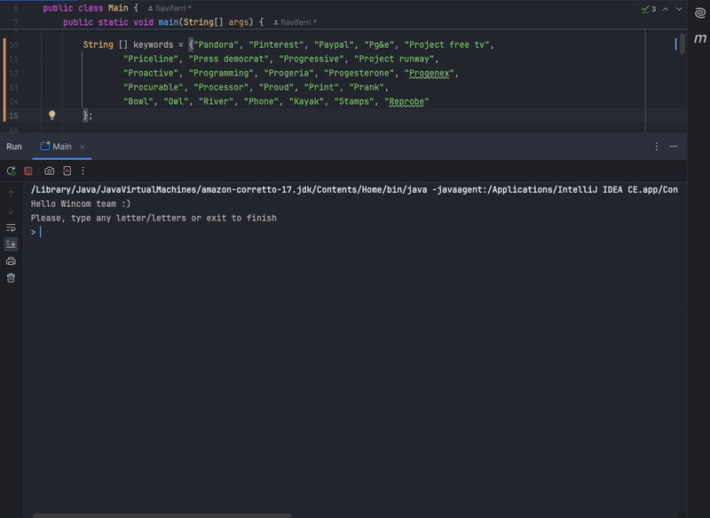

# Overview

This project implements a simple autocomplete feature that provides up to 4 suggestions based on the input string provided by the user. The suggestions are derived from a predefined list of keywords and are returned in alphabetical order. The project is implemented in Java and follows an object-oriented approach.

## Features

Autocomplete Suggestions: Provides up to 4 suggestions for a given input string.

Alphabetical Sorting: Results are always sorted alphabetically.

Case Insensitivity: Suggestions are generated regardless of the input's case.

Efficient Searching: Optimized for handling moderately sized keyword lists.

## Technologies Used

Java: Primary programming language for implementation.

JUnit: For testing the functionality.

## Problem Statement

Implement an autocomplete feature for the provided keyword list.

Ensure results are sorted alphabetically.

Handle case-insensitive input.

## Keywords

Pandora, Pinterest, Paypal, Pg&e, Project free tv, Priceline, Press democrat, Progressive, Project runway, Proactive, Programming, Progeria, Progesterone, Progenex, Procurable, Processor, Proud, Print, Prank, Bowl, Owl, River, Phone, Kayak, Stamps, Reprobe

## How It Works

Data Preparation: The keywords are preprocessed and stored in a case-insensitive data structure.

User Input: The user provides a string, and the program returns up to 4 suggestions.

Sorting: Suggestions are retrieved and sorted alphabetically before being returned.

## Example

## Prerequisites

Java Development Kit (JDK) 8 or higher

A code editor (e.g., IntelliJ IDEA, Eclipse, or VS Code)

## Code Explanation

The project is implemented using an object-oriented design.

## Algorithm:

Filters keywords starting with the input string.

Limits results to 4 suggestions.

Sorts results alphabetically.

## Testing:

JUnit tests ensure the method returns correct and expected results for various cases.

## About Me

Hi! I'm Flavia, a passionate backend developer with a knack for solving algorithmic challenges and crafting efficient, scalable solutions. My experience spans Java, Spring Boot, Angular and React, with a strong focus on clean, functional code. This project showcases my problem-solving abilities and dedication to quality. Let’s connect on LinkedIn!

